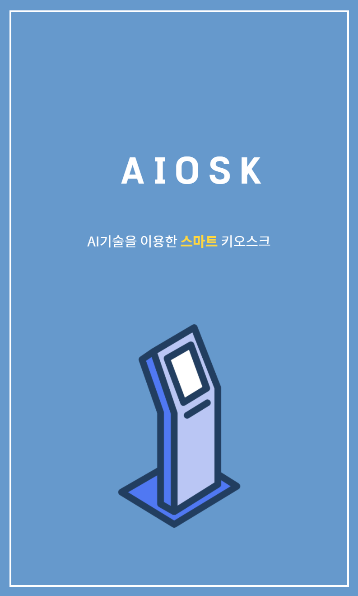
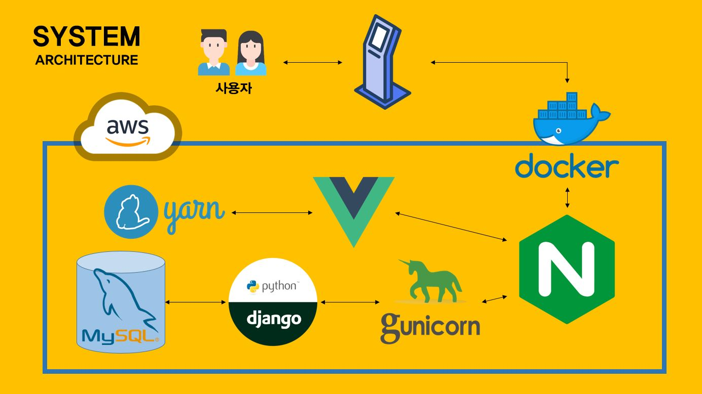
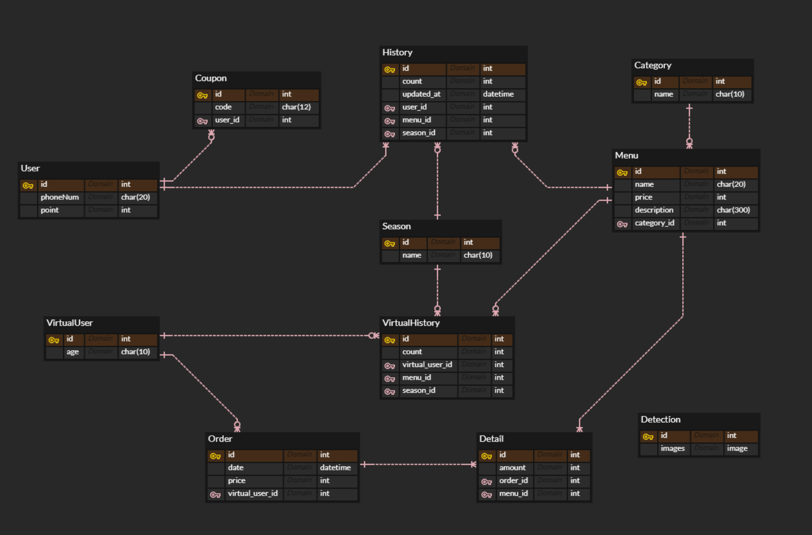
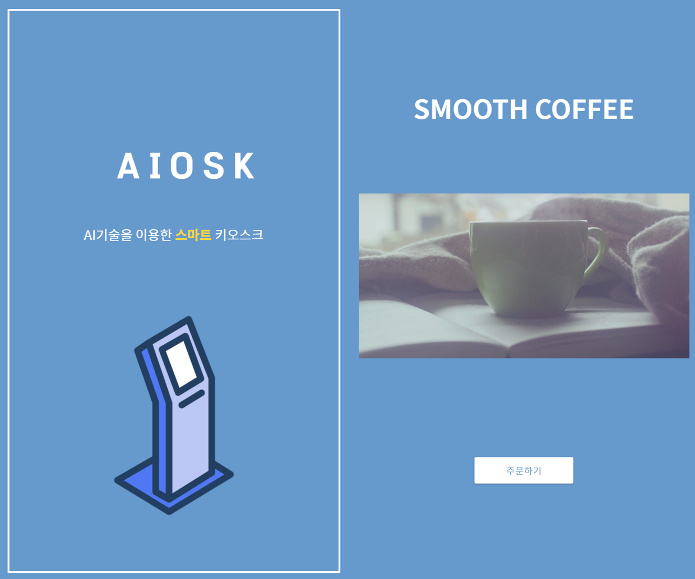
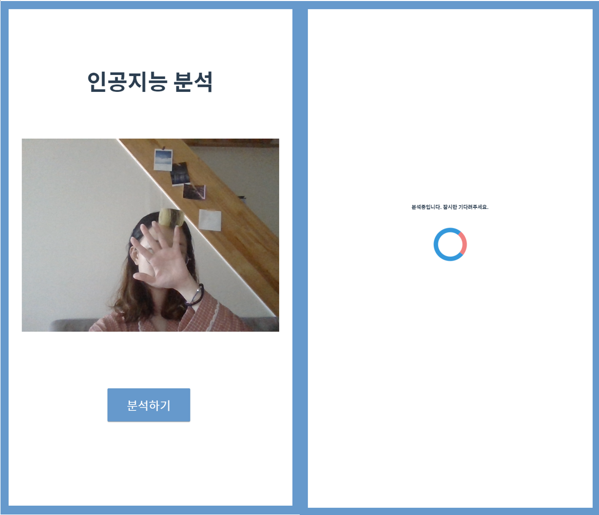
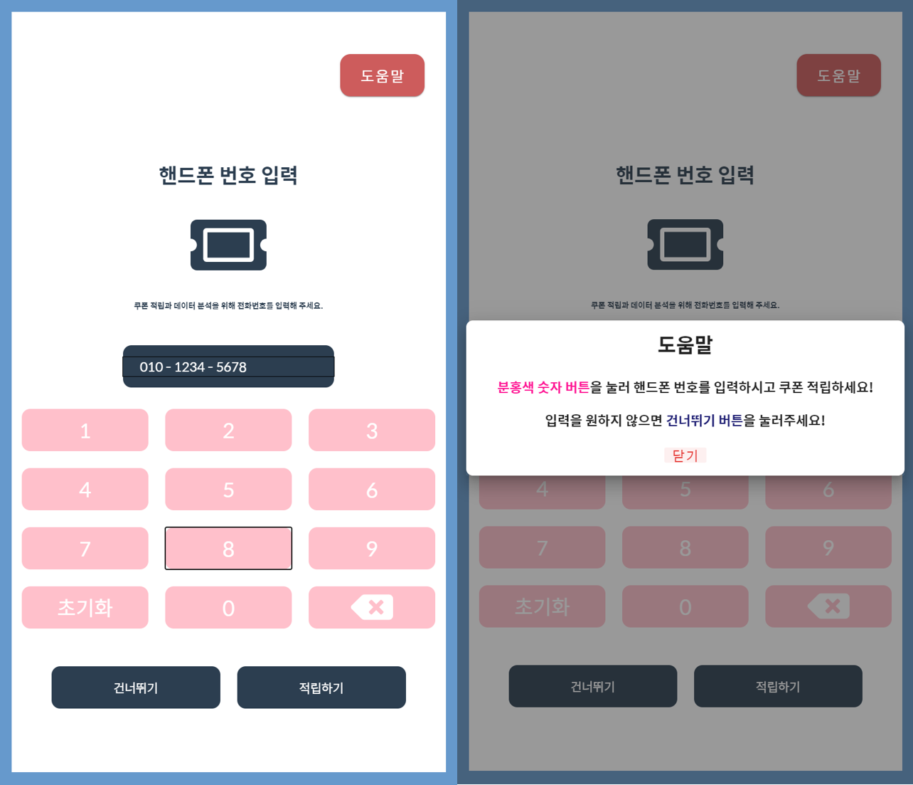
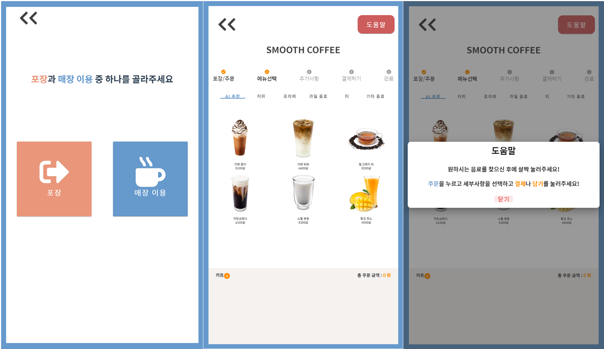
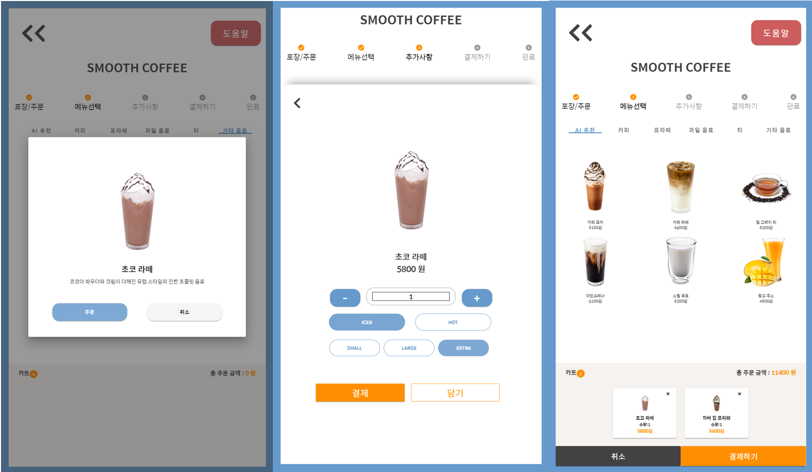
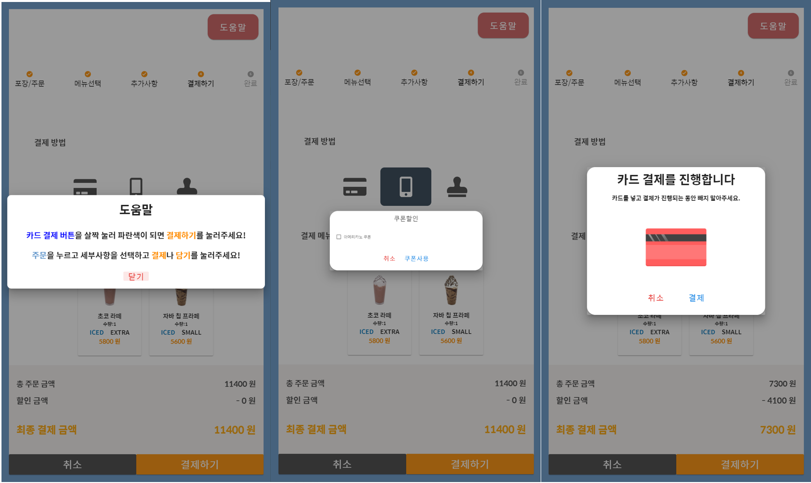

# 자율 프로젝트 - AIOSK

 ## 🐱‍💻 ㅅㅁㅅ 팀 

| 이름          | 담당                                           |
| ------------- | ---------------------------------------------- |
| 김영수 (팀장) | AI 모델 구현                                   |
| 박희웅        | 추천 알고리즘 구현                             |
| 이경민        | 서버 통신에 필요한 API 및 모델                 |
| 이동옥        | UI/UX(Front-End)                               |
| 최동녘        | Database 구성(학습 데이터 및 추천 데이터 수집) |
| 최수람        | UI/UX(Front-End)                               |

### :100: 프로젝트 진척률 : 100%

## 목차

-  AIOSK 란?
  - 프로젝트의 목표
  - 프로젝트 가상환경
- 시작하며...
  - 기술 스택
  - WBS
  - 와이어 프레임
  - 일정표 & 역할 분배표
  - 그라운드 룰
- 깃 컨벤션
  - Branch
  - commit
- AIOSK 는 개발중...
  - ERD
  - API 명세서
-  결과 화면


## 프로젝트 이름

**AIOSK** 는 AI기술을 이용한 스마트 키오스크 입니다.

키오스크를 사용하는 '다양한 연령층', '새로운 메뉴를 원하시는 분' 등등 즐겁고 편하게 키오스크를 사용하시길 원하는 분들을 위해 **스마트 키오스크**을 만들었습니다.

**「키오스크의 기술 소외 집단 문제를 해소하고 코로나 상황에 따라 발생하는 니즈를 충족」**을 목표로 합니다.

### 특징

- 이미지 분석을 통해 나이를 예측하고 그 나이때에 인기 있는 상품을 추천합니다.
- 사용자들의 빅데이터를 수집하고 이용하여 추천 알고리즘을 통해 상품을 추천합니다.
- 모션 인식을 통해 언택트 주문이 가능합니다.
- 연령별 키오스크 사용에 편리한 UI/UX를 제공합니다.
- 카카오 페이를 통해 간단한 결제 서비스를 포함하고 있습니다.




## :computer: 시작하며...

> 프로젝트를 시작하며 사용하게 되는 기술 스택 및 팀 룰에 관한 내용입니다.

### 기술 스택

-------------------------


### 시스템 아키텍쳐

----------------------------------------



### 와이어 프레임

-----------------------------------


### 그라운드 룰

> 팀만의 그라운드 룰을 적습니다.

## 깃 컨벤션

### Git-Branch

Git-flow는 다음과 같이 정해져있습니다.

- master : 배포 가능한 상태 브랜치
- develop : 업데이트 할 브랜치 + Docs 업데이트 브랜치
-  feature : 기능을 개발하는 브랜치
  - 기능 별  feature 브랜치의 이름
    - accounts
    - comments

### Git-commit

```bash
$ git commit -m "Jira 이슈 번호 | Header | 설명"
```

- JIRA 이슈 번호 or README
- Header
  - Initial : 가장 처음 만든 코드
  - Update : 정상적으로 동작하면서 수정/추가/보완된 코드
  - Fix : 비정상 동작 수정 코드
- 설명


## 프로젝트는 개발중...

### Entity-Relationship Diagram(ERD)

-----------------------




### API 명세서

-------------------------------

1. Accounts

   - 쿠폰 확인 (GET)

2. Kiosks

   - 메뉴 조회 (GET)

   - 결제 (POST)
     - 현금 결제
     - 카카오페이


## 결과 화면

> AI 분석에서 Senior로 분류되었을 경우, 도움말 창을 우선 보여주어 더 원활하게 키오스크를 사용할 수 있도록 함


### 1. 메인 페이지



### 

### 2. 인공지능을 이용한 연령대 분석 페이지

> 화면이 실시간으로 나오며 분석하기 버튼을 누를 시 연령층(younger/older/senior)을 분석함




### 3. 고객 정보(핸드폰 번호) 입력 페이지

> 핸드폰 번호를 입력하면 쿠폰을 적립할 수 있고, AI 기반 추천 서비스와 더불어 더욱 개인화된 추천 서비스를 이용할 수 있음
>
> 입력하지 않은 경우, AI를 통해 분석된 연령대에 맞춰 메뉴를 추천 받을 수 있음




### 4. 주문 페이지

> AI 추천 메뉴들과 카테고리별 메뉴를 확인할 수 있고, 메뉴를 골라 다양한 옵션을 선택하여 장바구니에 담거나 결제할 수 있음






### 5. 결제 페이지

> 카드/카카오페이 중 선택하여 결제하며, 쿠폰을 사용하여 할인 받을 수 있음




### 6. 주문 완료 페이지

> 정상적으로 주문이 완료되었음을 보여주고, 다시 메인 페이지로 이동

